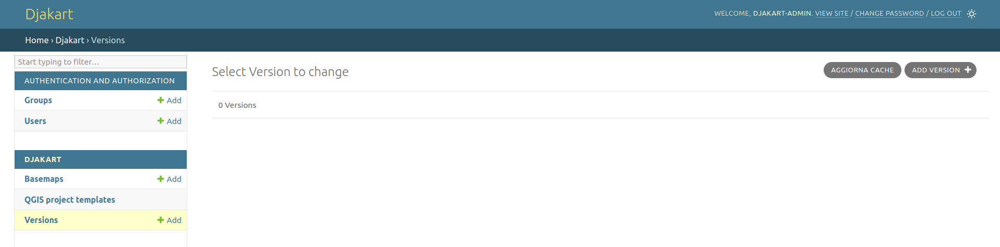
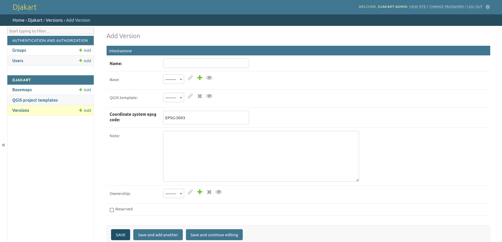
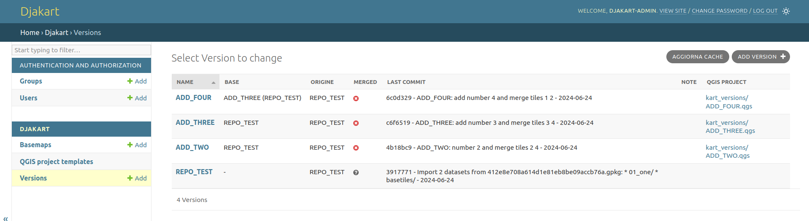
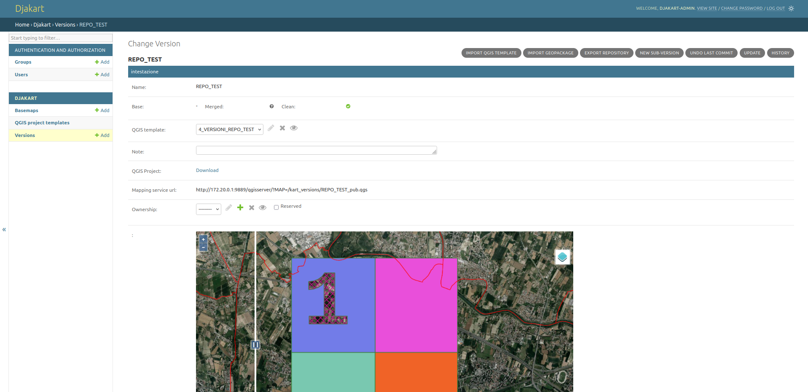
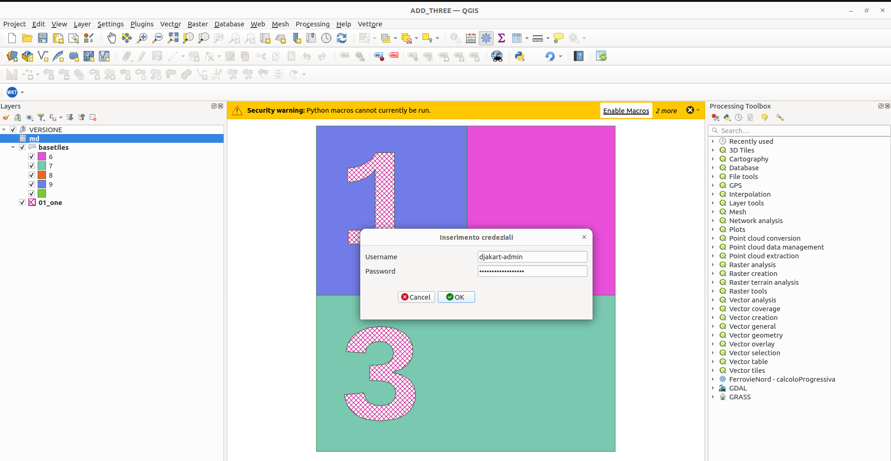
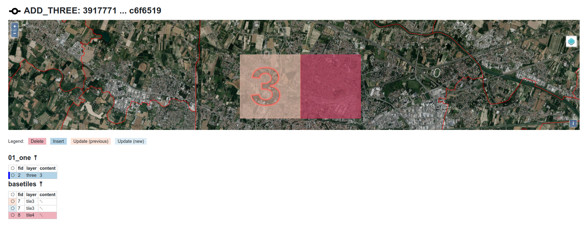
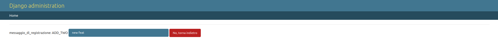
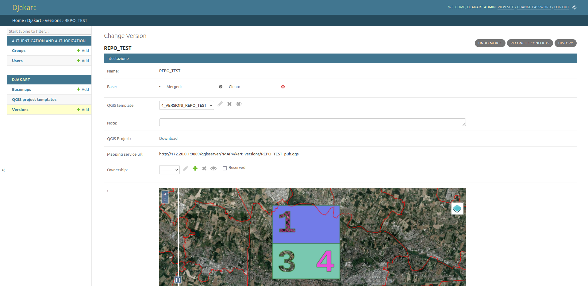
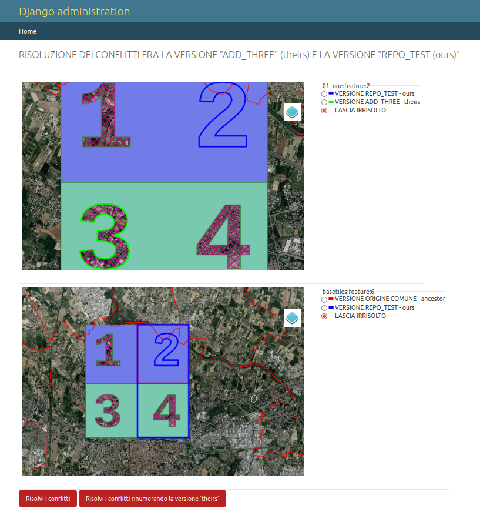

# Djakart

A django app for multiuser [kart versioning](https://kartproject.org/) in QGIS

## Deployment

1. clone the repository and enter djakart folder

```
$ git clone git@github.com:enricofer/djakart.git
$ cd djakart
```

2. build the images

```
$ docker build -t enricofer/qgis-server:latest ./build_qgis
$ docker build --build-context webapp_root=./webapp -t enricofer/djakart:latest ./build_webapp
```

3. start the containers

```
$ docker compose up -d
```

3. collect necessary static files

```
$ docker compose exec webapp_djakart /usr/bin/python3 manage.py collectstatic --no-input
```

4. create the superuser

```
$ docker compose exec webapp_djakart /usr/bin/python3 manage.py createsuperuser --no-input
```

5. for custom deployment .env environment file should be edited

6. login to [http://localhost:9889/admin](http://localhost:9889/admin)

```
login: djakart
password: letmein
```



Now you you can create a new Kart repository adding a new version



7. A sample dataset can be downloaded and installed overwriting data folder to quickly test the application (stop docker containers before install)

```
$ docker compose down 
$ wget https://github.com/enricofer/djakart/releases/download/0.1/test_data01.tar.gz
$ sudo tar --same-owner -xvf test_data01.tar.gz data/
$ docker compose up -d
```

Now you should have 4 new test repositories:



- REPO_TEST is the base kart repository 
- ADD_TWO AND ADD_THREE are edited clone branches of REPO_TEST
- ADD_FOUR is an edited clone of ADD_THREE repository

the repositories are store in data/kart_versions folder:

```
$ ll data/kart_versions
drwxrwxr-x 6 enrico enrico   4096 giu 24 20:47 ./
drwxrwxr-x 7 root   enrico   4096 giu 24 18:37 ../
drwxr-xr-x 3 root   root     4096 giu 24 20:11 ADD_FOUR/
-rw-r--r-- 1 root   root     2599 giu 24 20:47 ADD_FOUR.json
-rw-r--r-- 1 root   root   124315 giu 24 20:47 ADD_FOUR.qgs
drwxr-xr-x 3 root   root     4096 giu 24 20:04 ADD_THREE/
-rw-r--r-- 1 root   root     2157 giu 24 20:11 ADD_THREE.json
-rw-r--r-- 1 root   root   124322 giu 24 20:05 ADD_THREE.qgs
drwxr-xr-x 3 root   root     4096 giu 24 19:21 ADD_TWO/
-rw-r--r-- 1 root   root     2051 giu 24 20:02 ADD_TWO.json
-rw-r--r-- 1 root   root   124308 giu 24 19:50 ADD_TWO.qgs
drwxr-xr-x 3 root   root     4096 giu 24 18:43 REPO_TEST/
-rw-r--r-- 1 root   root     1604 giu 24 19:50 REPO_TEST.json
-rw-r--r-- 1 root   root   115007 giu 24 19:50 REPO_TEST_pub.qgs
```

Each kart version has a control form where can be configured custom features and user permissions (based on django user model), can be performed repository operation such commits, merge, etc.., and can be visually tracked edits on map ad on commit log



In the Version form can be downloaded  a custom QGIS project preloaded with internal postgis kart working copy of the repository. 

The default connection to postgis kart working copy are performed as `kart-user` a simple predefined user allowed only to read data fron db. To allow edits QGIS macros have to be allowed (project macros can be always allowed in Settings/options/General/Enable macros slot) When macros are allowed a credential form appears and can be inserted the read and write default user (from .env file): 

```
login: kart-admin
password: ch1appalaCH!APPAL4
```



All edits will be visible in djakart application as a custom kart diff window clicking on log items



now to fully test the application:

- commit the pending edits on the version "ADD_TWO" 

  

- merge the version "ADD_TWO" on "REPO_TEST"

- merge the version "ADD_FOUR" on "ADD_THREE"

- and now merge the version "ADD_THREE" on "REPO_TEST"

at this point the last merge results conflicting with the main repo and the conflicts have to be reconciled with "RECONCILE CONFLICTS"action



for each conflict you have now to choice the winning edit from ours and theirs concurrent merging versions


